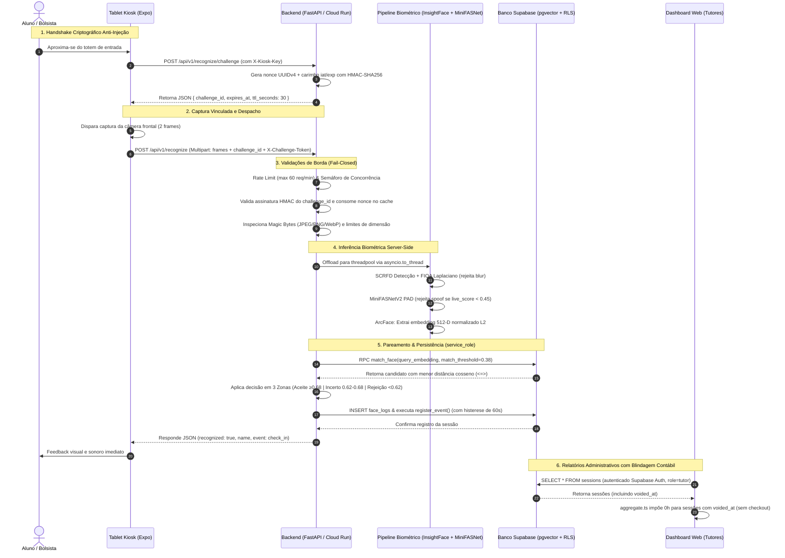

# AILAB-FACIAL V5 — FLUXO DE DADOS & FRONTEIRAS DE CONFIANÇA
**Banca Técnica Multidisciplinar Nível Principal/Staff**  
**Data:** 13 de Setembro de 2026 | **Versão:** V5 Definitiva  
**Status:** 100% AUDITADO E MITIGADO  

---

## 1. Diagrama de Fluxo de Dados Ponta a Ponta (V5)

---

## 2. Análise Detalhada das Fronteiras de Confiança (Trust Boundaries)

### Fronteira TB-1: Sensor Físico $\rightarrow$ App Móvel (Tablet Kiosk)
- **Quem controla o dado?** O hardware do tablet Android e o ambiente físico do laboratório.
- **Controles V5:** Detecção ativa de spoofing facial via MiniFASNetV2 no servidor, descartando fotos em papel, telas digitais ou réplicas 2D antes da comparação de identidade.
- **Canal Duplo de Comunicação:**
  - **Canal 1 (Kiosk):** Utiliza `X-Kiosk-Key` exclusivamente para inferência biométrica, desafio temporal e leitura de horas do próprio integrante pós-checkin.
  - **Canal 2 (Tutor):** Operações de matrícula em `/enroll` exigem login nominal no Supabase Auth (`tutorToken`) com perfil de tutor confirmado no backend. A chave mestra foi extirpada do aplicativo móvel.

### Fronteira TB-2: App Móvel / Cliente Web $\rightarrow$ Backend FastAPI (Rede Externa)
- **Quem controla o dado?** O cliente (considerado não-confiável).
- **Controles V5:**
  - **Desafio Temporal Criptográfico:** Token HMAC-SHA256 obrigatório com TTL de 30s e invalidação atômica de uso único, impedindo gravação e replay de frames via `curl`.
  - **Rate Limiting:** Janela deslizante de 60 requisições por minuto por quiosque/IP.
  - **Semáforo Assíncrono:** Teto de 10 inferências concorrentes simultâneas por worker contra ataques de exaustão de CPU.
  - **Validação de Assinatura Binária (Magic Bytes):** Bloqueio de arquivos corrompidos ou maliciosos (JPEG `\xff\xd8\xff`, PNG `\x89PNG`, WebP `RIFF...WEBP`) antes de qualquer processamento pesado.

### Fronteira TB-3: Backend FastAPI $\rightarrow$ Banco de Dados Supabase (Service Role)
- **Quem controla o dado?** O processo do backend FastAPI.
- **Controles V5:** Conexão HTTPS/TLS criptografada; uso restrito da `SUPABASE_SERVICE_KEY`; índice parcial UNIQUE impedindo sessões duplicadas abertas para o mesmo integrante.

### Fronteira TB-4: Banco de Dados Supabase $\rightarrow$ Clientes Anônimos e Autenticados (PostgREST Direto)
- **Quem controla o dado?** O banco de dados PostgreSQL aplicando Row Level Security (RLS).
- **Controles V5:**
  - RLS forçado em todas as tabelas (`profiles`, `sessions`, `face_embeddings`, `face_logs`).
  - Políticas sincronizadas entre `schema.sql` e a migração 05: escrita restrita a usuários com `(auth.jwt() -> 'app_metadata' ->> 'role') = 'tutor'`.
  - Embeddings faciais inacessíveis para leitura ou escrita externa de usuários `anon` e `authenticated`.

---

## 3. Rastreabilidade de Retenção e Descarte de Dados (Conformidade LGPD Art. 16)

| Estágio do Dado | Onde Vive | Tempo de Retenção | Nível de Proteção | Status V5 |
|---|---|---|---|:---:|
| **Frame Bruto de Câmera** | Memória RAM volátil | Duração da requisição HTTP ($\approx 120-250$ ms) | Nunca gravado em disco; descartado imediatamente após extração | **CONFORME** |
| **Vetor Biométrico (Embedding 512-D)** | Tabela `face_embeddings` | Permanente enquanto o titular for membro ativo | Isolado por RLS estrito (sem políticas de leitura pública) | **CONFORME** |
| **Log Facial de Auditoria** | Tabela `face_logs` | **Máximo de 90 dias** (Expurgo automático) | Rotina periódica `purge_old_face_logs()` em `/maintenance/cleanup` | **CONFORME** |
| **Registros de Presença** | Tabela `sessions` | Permanente (histórico acadêmico) | Sessões abandonadas registram `voided_at` e contabilizam 0h | **CONFORME** |
