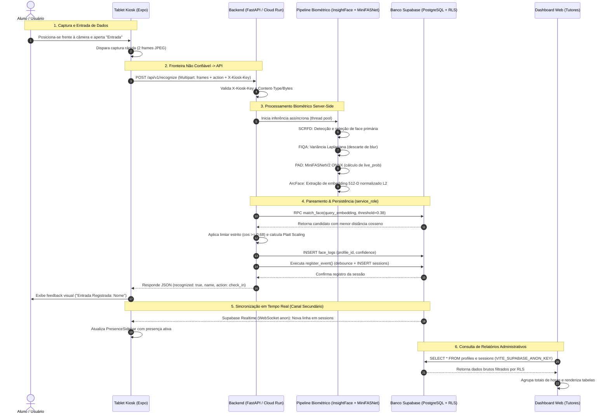

# AILAB-FACIAL V4 — FLUXO DE DADOS & FRONTEIRAS DE CONFIANÇA

**Data:** 13 de Setembro de 2026  
**Auditoria:** AILAB-FACIAL V4  
**Status:** AUDITED  

---

## 1. Diagrama de Fluxo de Dados Ponta a Ponta

---

## 2. Análise Detalhada das Fronteiras de Confiança (Trust Boundaries)

### Fronteira TB-1: Sensor Físico $\rightarrow$ App Móvel (Tablet)
- **Quem controla o dado?** O ambiente físico e o hardware do tablet Android.
- **Quem pode alterar?** Um atacante físico pode posicionar fotos, máscaras ou telas em frente ao sensor. Um atacante com acesso root ou depuração USB pode instalar drivers de câmera virtual (ex: OBS Virtual Camera for Android) para alimentar o app com vídeo sintético.
- **Controles:** Permissões de câmera do sistema operacional Android.
- **Fragilidade:** O aplicativo não implementa verificações de integridade de dispositivo (Google Play Integrity API) nem checa se a câmera é um dispositivo físico genuíno.

### Fronteira TB-2: App Móvel / Cliente Web $\rightarrow$ Backend FastAPI (Rede Externa)
- **Quem controla o dado?** O cliente (totalmente não confiável).
- **Quem pode alterar?** O atacante controla 100% dos bytes enviados via HTTP (headers, parâmetros multipart, imagens binárias).
- **Controles:** TLS 1.3 (Google Cloud Run), cabeçalhos de autenticação (`X-Kiosk-Key`, `Authorization`), validação MIME (`validate_image`) e tamanho máximo de arquivo (5 MB).
- **Fragilidade:** Não há nonce, desafio efêmero nem carimbo de tempo assinado pelo servidor. O backend não consegue discernir se a imagem foi capturada naquele instante ou gravada semanas antes.

### Fronteira TB-3: Backend FastAPI $\rightarrow$ Banco de Dados Supabase (Service Role)
- **Quem controla o dado?** O processo do backend FastAPI.
- **Quem pode alterar?** Qualquer código executado pelo backend.
- **Controles:** Conexão HTTPS criptografada; uso de `SUPABASE_SERVICE_KEY` privada (bypass de RLS).
- **Fragilidade:** Como o backend usa a chave `service_role`, o banco confia cegamente nas mutações enviadas. Não há validação de integridade por triggers para impedir que o backend grave timestamps passados ou futuros anômalos.

### Fronteira TB-4: Banco de Dados Supabase $\rightarrow$ Clientes Anônimos e Autenticados (PostgREST Direto)
- **Quem controla o dado?** O banco de dados PostgreSQL aplicando Row Level Security (RLS).
- **Quem pode alterar?** Usuários anônimos (chave `anon`) e autenticados (JWT do Supabase Auth).
- **Controles:** RLS ativo e forçado nas tabelas `profiles`, `sessions`, `face_embeddings` e `face_logs`.
- **Fragilidade:** As políticas RLS originais em `schema.sql` concediam `ALL` para `authenticated` na tabela `sessions` (`USING (true)`). A migração 05 corrigiu isso, mas a falta de sincronização com o `schema.sql` expõe o banco a regressão crítica.

---

## 3. Rastreabilidade de Retenção e Descarte de Dados

| Estágio do Dado | Onde Vive | Tempo de Retenção | Nível de Proteção | Risco de Vazamento |
|---|---|---|---|---|
| **Frame Bruto de Câmera** | RAM do Tablet / RAM do Backend | Efêmero (duração do request HTTP, $\approx 150-600$ ms) | Em memória volátil; nunca persistido em disco | Baixo (se não houver logs de debug contendo dumps binários). |
| **Vetor Biométrico (Embedding)** | Tabela `face_embeddings` no Supabase | Permanente enquanto o titular estiver ativo | Protegido por RLS estrito (sem policy para `anon`/`authenticated`) | Alto caso ocorra vazamento da `SUPABASE_SERVICE_KEY`. |
| **Log Facial com Confiança** | Tabela `face_logs` no Supabase | Permanente (ou até execução de cleanup manual) | Protegido por RLS | Baixo; expõe apenas score e timestamp. |
| **Registros de Presença** | Tabela `sessions` no Supabase | Permanente (histórico acadêmico de horas) | Acessível por tutores e leitura de sessões abertas por `anon` | Médio; dados de presença revelam rotina física de estudantes. |
