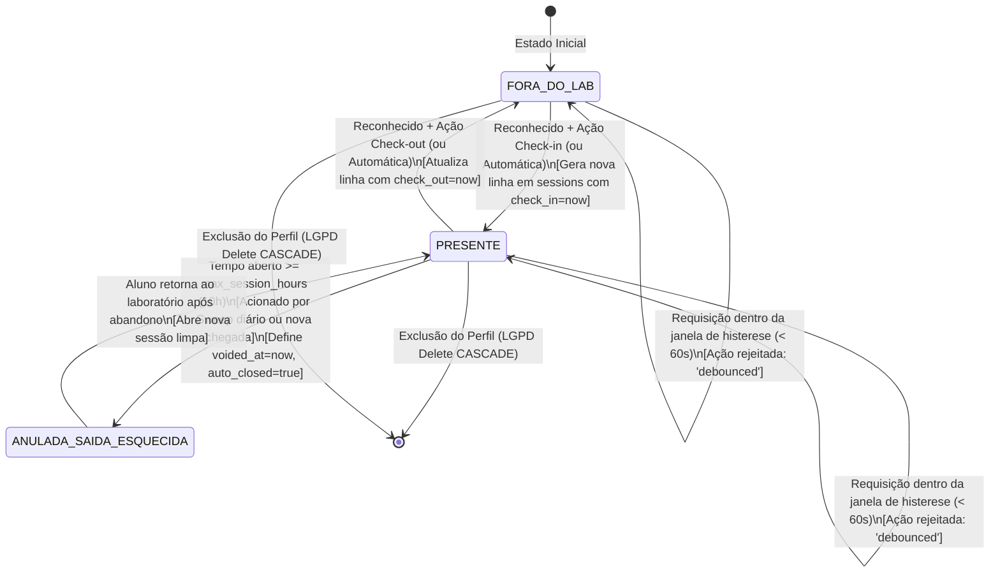

# AILAB-FACIAL V4 — AUDITORIA DA MÁQUINA DE ESTADOS DE SESSÕES

**Data:** 13 de Setembro de 2026  
**Auditoria:** AILAB-FACIAL V4  
**Status:** AUDITED  

---

## 1. Diagrama de Transição de Estados (Ciclo de Vida da Presença)



---

## 2. Auditoria das Transições de Estado

| Transição | Gatilho | Pré-condição | Efeito no Banco de Dados | Comportamento sob Falha / Concorrência | Veredito |
|---|---|---|---|---|:---:|
| **T1: Entrada Regular** | Reconhecimento facial com score $\ge 0.68$ | Sem sessão aberta anterior; intervalo $> 60$ s do último evento | `INSERT INTO sessions (profile_id, check_in) VALUES (id, now())` | Se duas entradas concorrentes chegarem ao mesmo tempo, o índice parcial UNIQUE barra a segunda com erro 23505; o código trata e retorna `already_in`. | **VERIFIED** |
| **T2: Saída Regular** | Reconhecimento facial com score $\ge 0.68$ | Sessão aberta existente com `check_out IS NULL`; intervalo $> 60$ s | `UPDATE sessions SET check_out = now() WHERE id = sess_id` | Se duas saídas concorrentes chegarem juntas, ambas executam o update. Não há lock atômico, mas o efeito resultante é idempotente no timestamp final. | **VERIFIED** |
| **T3: Histerese (Debounce)** | Qualquer tentativa de reconhecimento | Intervalo desde o último evento $< 60$ s | Nenhuma mutação no banco | Retorna `debounced` com tempo de espera restante `wait_seconds`. | **VERIFIED** |
| **T4: Saída Esquecida (Sweep)** | Chamada periódica `/sessions/close-stale` ou reentrada após $> 10$ h | Sessão aberta com `now() - check_in >= 10h` | `UPDATE sessions SET check_out = now(), voided_at = now(), auto_closed = true WHERE id = sess_id` | A sessão é fechada para liberar o índice único e `duration_s` vira `NULL`. Backend conta 0h, mas frontend web distorce e credita as horas. | **VULNERABLE (F-001)** |
| **T5: Reentrada com Sessão Stale** | Aluno retorna no dia seguinte sem ter batido saída | Sessão aberta do dia anterior $> 10$ h | Executa T4 (anula sessão anterior) e imediatamente executa T1 (abre nova sessão) | Transição tratada sequencialmente em `session_service.py:register_event`. | **VERIFIED** |

---

## 3. Análise de Estados Proibidos e Ataques de Máquina de Estados

### Estado Proibido ES-1: Múltiplas Sessões Abertas para o Mesmo Aluno
- **Risco:** Aluno acumular horas duplicadas simultaneamente em turnos concorrentes.
- **Proteção:** Garantida fisicamente pelo PostgreSQL via `CREATE UNIQUE INDEX idx_sessions_profile_single_open ON sessions (profile_id) WHERE check_out IS NULL;`.
- **Resultado:** **Impossível ocorrer no banco.**

### Estado Proibido ES-2: Check-out Imediato Acidental (Double-Click / Jitter)
- **Risco:** O aluno bate ponto para entrar e a câmera dispara um segundo frame 3 segundos depois, registrando saída acidental.
- **Proteção:** Dupla camada de histerese em `session_service.py`:
  1. `_last_event_ts`: Verifica o carimbo de data/hora de qualquer evento recente nos últimos 60 segundos.
  2. Trava explícita de check-out: Se `action is None` e `(now - check_in_dt) < 60s`, retorna `debounced`.
- **Resultado:** **Mitigado com sucesso.**

### Estado Proibido ES-3: Manipulação de Transição por Ação Inconsistente Fornecida pelo Cliente
- **Risco:** O cliente envia `action="check_in"` quando já está no laboratório, ou `action="check_out"` quando está fora.
- **Proteção:** Validação semântica estrita:
  ```python
  if action == "check_in" and open_sess is not None:
      return {"action": "already_in", "profile_id": profile_id}
  if action == "check_out" and open_sess is None:
      return {"action": "not_in", "profile_id": profile_id}
  ```
- **Resultado:** **Mitigado.** O sistema não permite forçar uma transição inválida.
