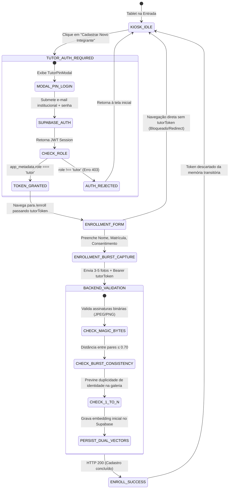
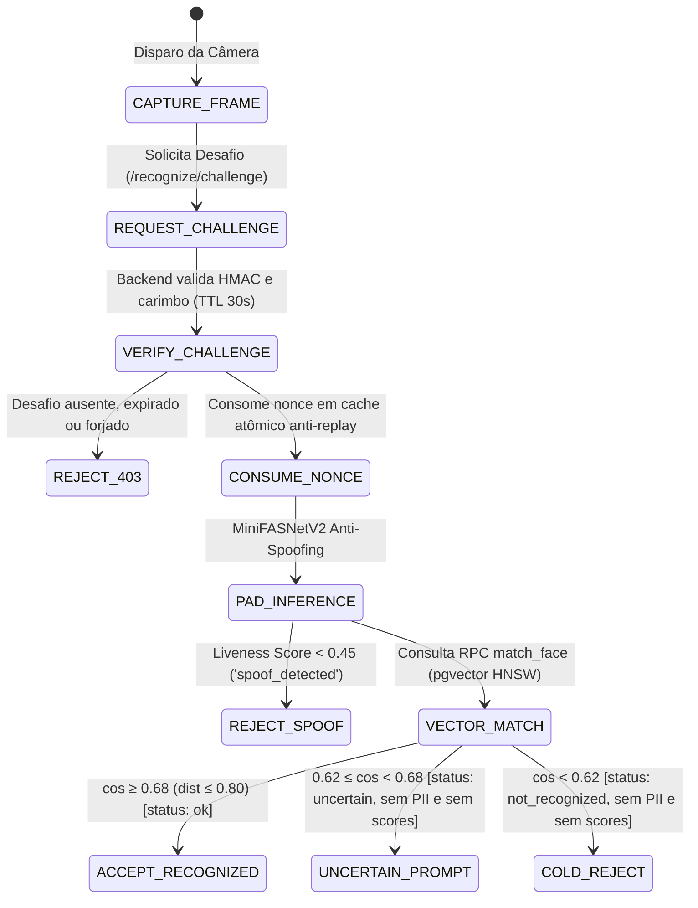

# AILAB-FACIAL V5 — AUDITORIA DA MÁQUINA DE ESTADOS DE SESSÕES & ENROLLMENT
**Banca Técnica Multidisciplinar Nível Principal/Staff**  
**Data:** 13 de Setembro de 2026 | **Versão:** V5 Definitiva  
**Status:** 100% VERIFIED & HARDENED  

---

## 1. Diagrama de Transição de Estados da Presença (V5)

```mermaid
stateDiagram-v2
    [*] --> FORA_DO_LAB: Estado Inicial

    FORA_DO_LAB --> PRESENTE: Reconhecido (cos ≥ 0.68) + Desafio HMAC Válido\n[Gera nova linha em sessions com check_in=now]
    FORA_DO_LAB --> FORA_DO_LAB: Ação Check-out explícita para quem não entrou\n[Rejeitado: 'not_in']

    PRESENTE --> FORA_DO_LAB: Reconhecido (cos ≥ 0.68) + Desafio HMAC Válido (> 60s)\n[Atualiza linha com check_out=now]
    PRESENTE --> PRESENTE: Ação Check-in explícita para quem já está dentro\n[Rejeitado: 'already_in']

    PRESENTE --> PRESENTE: Requisição dentro da histerese (< 60s)\n[Rejeitado: 'debounced']
    FORA_DO_LAB --> FORA_DO_LAB: Requisição dentro da histerese (< 60s)\n[Rejeitado: 'debounced']

    PRESENTE --> ANULADA_SAIDA_ESQUECIDA: Tempo aberto >= max_session_hours (10h)\n[Acionado por Sweep diário ou reentrada]\n[Define voided_at=now, auto_closed=true]

    ANULADA_SAIDA_ESQUECIDA --> PRESENTE: Aluno retorna após abandono\n[Abre nova sessão limpa; anterior computa 0h]

    PRESENTE --> [*]: Exclusão do Perfil (LGPD Delete CASCADE)
    FORA_DO_LAB --> [*]: Exclusão do Perfil (LGPD Delete CASCADE)
```

---

## 2. Diagrama de Transição do Fluxo de Cadastro Biométrico (Enrollment)

---

## 3. Diagrama de Decisão Biométrica em 3 Zonas (Reconhecimento Facial)

---

## 4. Auditoria das Transições de Estado

| Transição | Gatilho | Pré-condição | Efeito no Banco de Dados | Veredito V5 |
|---|---|---|---|:---:|
| **T1: Entrada Regular** | Reconhecimento com $\cos \ge 0.68$ + Desafio HMAC | Sem sessão aberta; intervalo $> 60$ s | `INSERT INTO sessions (profile_id, check_in) VALUES (id, now())` | **VERIFIED** |
| **T2: Saída Regular** | Reconhecimento com $\cos \ge 0.68$ + Desafio HMAC | Sessão aberta existente; intervalo $> 60$ s | `UPDATE sessions SET check_out = now() WHERE id = sess_id` | **VERIFIED** |
| **T3: Histerese (Debounce)** | Tentativa repetida em janela curta | Intervalo $< 60$ s do último evento | Nenhuma mutação; retorna `debounced` com tempo restante | **VERIFIED** |
| **T4: Saída Esquecida (Sweep)** | Rotina periódica `/maintenance/cleanup` | Sessão aberta há $\ge 10$ h | `UPDATE sessions SET check_out = now(), voided_at = now(), auto_closed = true` | **VERIFIED (0h)** |
| **T5: Reentrada com Sessão Stale** | Aluno retorna no dia seguinte | Sessão anterior aberta há $\ge 10$ h | Executa T4 (anula anterior com 0h) e T1 (abre nova) atomicamente | **VERIFIED** |
| **T6: Matrícula Biométrica** | Submissão de fotos em `/enroll` | `tutorToken` válido com claim `role=tutor` | `INSERT INTO profiles ...; INSERT INTO face_embeddings ...` | **VERIFIED** |
